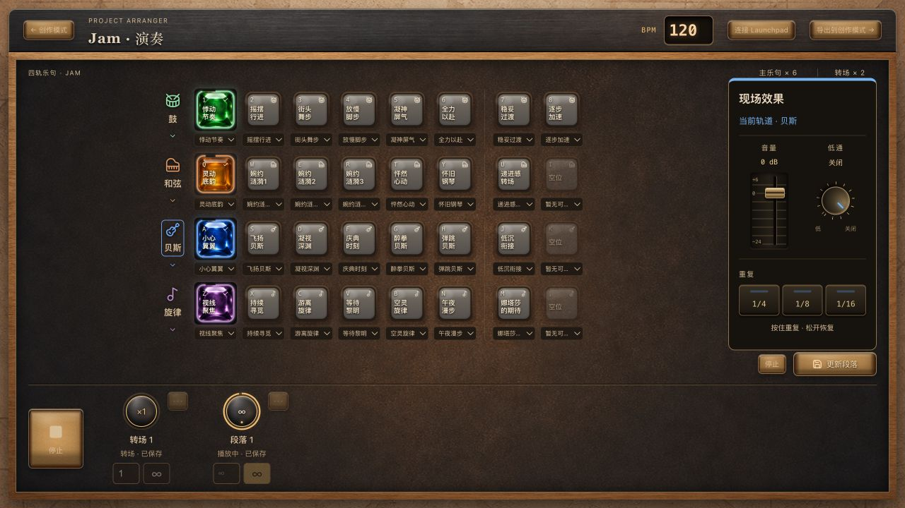
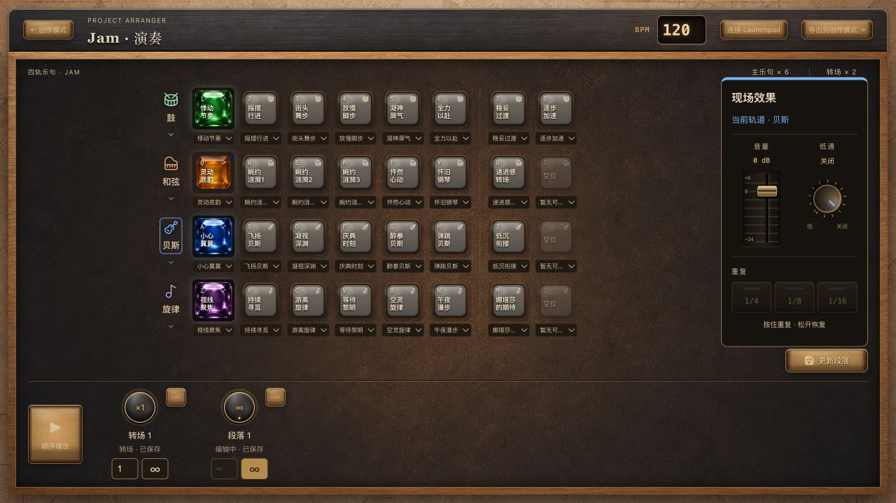
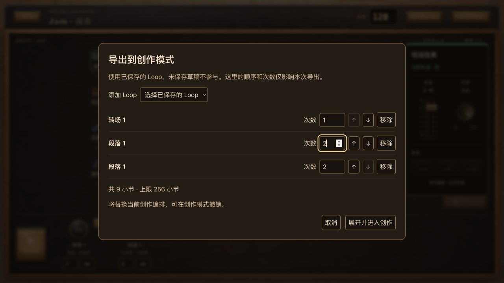
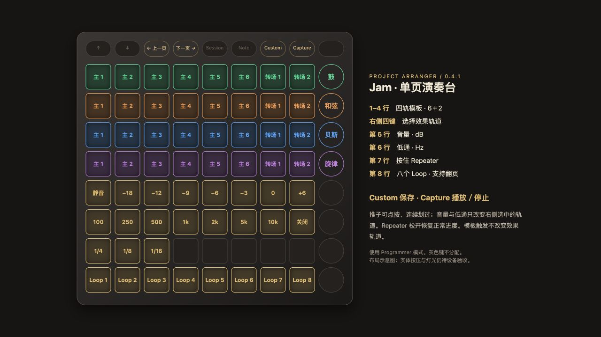

# v0.4.1 · Jam 演奏工作流

版本日期：2026-09-30。分支：`feat/v041-jam-performance`。本轮仅本地提交，未推送、未合并、未发布。

Notion：[v0.4.1 使用说明与验收记录](https://app.notion.com/p/3ead48cb1eee8135bca5ca935d5e2e3f)

## 页面与操作

演奏入口统一进入独立 Jam 页面。原 Live 曲式页及 Jam 编辑弹层已移除，创作模式继续保留。流程为：选择四轨模板组合 → 试听和效果控制 → 保存 Loop → 调整顺序和次数 → 连续演奏或导出创作。

每轨显示六个主乐句和两个转场宝石；按宝石选择，再按取消。下拉替换当前方块绑定，候选按同轨、同类型去重，不自动播放或覆盖保存内容。点轨道图标选择效果轨道，点图标下方箭头选择音色。

保存按钮在模板区下方。至少一个选中乐句且全部为转场时保存为转场，否则为段落；空组合不可保存。保存后停止、清空组合，保留音色和 BPM。已有 Loop 点击载入当前草稿并试听，保存更新原 ID；独立菜单可重命名和删除。草稿只在当前会话有效，切换对象不丢失，刷新仅恢复已保存内容。

## 现场效果

右侧 DJ 台音量为 −24～+6 dB，最低静音；低通 100～20000 Hz，最大关闭。三个垫分别重复 1/4、1/8、1/16 音符长度的音频切片；按住重复，松开回到仍在运行的时钟位置。Space／Enter 可操作聚焦的垫，不触发整组播放。

音量随会话保留并进入创作导出；滤波与 Repeater 仅现场使用。屏幕与硬件共享效果轨道和按压管理，后按接管，旧按键松开不打断新按键。停止、保存、切轨、失焦、取消输入、断连及离开 Jam 释放重复；失焦及离开 Jam 也关闭低通。

## Loop 次数与顺序演奏

Loop 横向拖动排序，音乐副本和 ID 不变。次数支持正整数与 ∞；新段落默认 ∞，新转场默认一次。顺序和次数即时保存，不覆盖音乐草稿。播放及准备期间锁定排序、次数、重命名和删除。

左侧固定顺序播放／停止按钮从第一个有内容的草稿开始，使用启动时快照，按列表顺序和次数演奏，跳过空草稿；有限序列结束停止。∞ 不自动进入下一个 Loop。该版本不提供 Jam 暂停或整体撤销。

单 Loop 点击按自身次数试听，再点正在试听的 Loop 停止。点击其他 Loop 在下一小节切换，再点待切换目标取消；整组播放中点击 Loop 会转为单个试听。空草稿只载入并停止声音。播放中修改当前模板组合在下一小节生效，重新计算周期；宝石绕边和 Loop 圆环使用真实音频时钟。

## 导出到创作

顶部“导出到创作模式”停止声音并打开独立弹窗，默认使用已保存 Loop 的当前顺序和次数。可以重复添加、移除、上下移动和设置本次次数，不修改 Jam 列表。未保存草稿不参与；∞ 必须填写有限次数。

导出显示总小节数，超过 256 禁止确认。保留音符、休止、音色、BPM、音量，不携带现场效果。完整构建校验后作为一次创作撤销替换工程；失败保留原工程。取消关闭不恢复播放，弹窗期间屏幕和硬件演奏输入隔离。

## 新音色与数据兼容

贝斯可选“圆润电贝司／深秋贝斯”，旋律可选“空气感合成器／深秋旋律”，两轨不再提供占位菜单；鼓、和弦原有两个选项不变。旧音色 ID 仍能解析和回退。

实际录入 Bass.zip 的 9 个 WAV（E0～F1）与 Melody.zip 的 15 个 WAV（C3～C5）。均为双声道、24-bit、44100 Hz；贝斯采样约 1.8～1.899 秒，旋律 2.4 秒。资源随应用发布，实时播放、创作播放和 WAV 渲染共用音源映射并保留自然尾音。加载完成不会越过停止或新启动请求。

沿用 v4 会话键，读取补齐 Loop 次数，写回移除旧 Live columns 和独立副本；不保留恢复入口，不清空其他 localStorage，不改创作工程。已有 Jam 内容、名称、ID、模板绑定、BPM、音色和音量继续有效。

## Launchpad 单页布局

使用 Programmer 模式，自定义页面逻辑由应用实现；不使用原生推子页。

| 位置 | 功能 |
|---|---|
| 前四行 | 鼓、和弦、贝斯、旋律各 6 主＋2 转场 |
| 右侧前四键 | 效果轨道选择；模板触发不改变选轨 |
| 第五行 | 静音、−18、−12、−9、−6、−3、0、+6 dB |
| 第六行 | 100、250、500、1000、2000、5000、10000 Hz、关闭 |
| 第七行前三格 | 1/4、1/8、1/16 Repeater |
| 第八行 | 八个 Loop，按当前排序 |
| 顶部左右箭头 | Loop 翻页，不打断播放 |
| Custom | 保存当前组合 |
| Capture | 停止／准备中取消；停止时开始顺序播放 |

推子可连续划过，参数使用现有音频平滑过渡；屏幕精细值按最近档位显示灯光。空位不可触发，其余键无分配并熄灭。删除、重排及页码夹取都基于稳定 Loop ID 和实时列表。

设备模式参考：[Novation 官方设置说明](https://userguides.novationmusic.com/hc/en-gb/articles/23731440793490-Launchpad-X-s-Settings-menu)。实体设备未接入，本图为最终映射示意。

## 功能提交

每条为一个完整功能提交，按依赖顺序完成：

| 需求 | 完整 SHA | 标题 | 当次检查 |
|---|---|---|---|
| 10.33 | 9218e0cbb7363bf041d545bd87c2679e30b07444 | feat(jam): replace live workspace and export saved loops (10.33) | 715 tests、lint、build |
| 10.32 | 10b0d019980254f5b73a736602583f22365b957d | feat(jam): share selected-track effects and repeater ownership (10.32) | 717 tests、lint、build |
| 10.35 | 15e474aba3e498fac2de7ba9e501cc17a1108a76 | feat(audio): add deep autumn bass and melody banks (10.35) | 718 tests、lint、build |
| 10.36 | f4155c3dec94c316fbd10fcd511fa10311bdbc60 | feat(jam): reorder loops and persist repeat counts (10.36) | 720 tests、lint、build |
| 10.37 | e39c73b17cf22ad6cc9c2bc7c7bc672cfb8b0673 | feat(jam): sequence saved loops and quantize solo previews (10.37) | 714 tests、lint、build |
| 10.34 | 36e217e689622501820466d05304a5f32d425f54 | feat(launchpad): add single-page jam controls and effects (10.34) | 713 tests、lint、build |

## 验证记录与边界

最终 npm test：713 项全部通过；npm run lint、npm run build 通过。构建仍提示主包超过 500 kB，没有新增构建失败。测试数量变化来自删除已移除的 Live 专属播放／灯光验证、改为 Jam 序列和新硬件映射回归，并非沿用旧结果。

自动化覆盖旧会话迁移、草稿隔离、次数字段、顺序、稳定 ID、空列表、有限结束、∞、加载取消、边界首音、重复器所有权、模板与外围 MIDI 映射、LED 输出、音源映射及 WAV、256／257 导出边界。

桌面浏览器已检查 1280×720 与 960×720：四轨组合与两种新音色加载、保存后清空、转场默认一次、有限序列结束、单 Loop 无限试听、切轨效果、Repeat 空格操作不穿透、拖拽无误播放、刷新保留排序次数；临时导出重复添加、257 小节禁用、∞ 次数校验、9 小节导出后一次撤销回到 8 小节并重做恢复 9；创作入口返回 Jam 正常。控制台无错误。

未完成专项：实体 Launchpad 的触感、连续划过、断连和灯光；主观听感、转调音质、长时间音频连续性。自动化与页面成功启动不替代这些验收。10.32、10.34、10.35 保持“待专项验收”，不勾选完成。

首页 AI 演示流程也已实测：选择本地测试截图、生成建议、点击“在演出模式继续”，直接进入独立 Jam 页面。

本地预览：运行 npm run dev，再打开 /arranger-demo/tests/manual-v041.html。旧 manual-v040.html 仅作为兼容入口，实际代码为当前版本。
